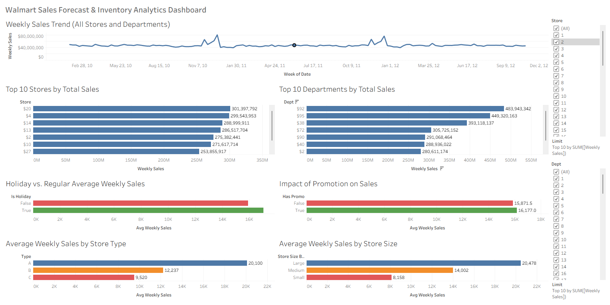

# Data Analytics Project – Walmart Sales Forecasting & Insights

## 📌 Overview
This project is a **Data Analytics capstone** that focuses on analyzing and forecasting Walmart’s retail sales data. It leverages:
- **Data preparation scripts** for cleaning and feature engineering
- **Exploratory and statistical analysis**
- **Visualization in Tableau**
- **Final datasets and aggregated reports**

The project provides actionable insights into sales performance across different stores, departments, promotions, and holidays.

---

## 🚀 Features
- 📊 **Data Preparation** – Scripts to merge, clean, and preprocess raw Walmart datasets.
- 🧮 **Feature Engineering** – Adds meaningful features (e.g., holidays, store types, promotions).
- 📈 **Sales Analysis** – Generates reports on sales trends across stores and departments.
- 📊 **Tableau Dashboard** – Interactive dashboard for visual exploration (`tables.twb`).
- 📂 **Outputs** – Aggregated CSVs containing key insights such as promo impacts and top-performing stores.

---

## 📂 Project Structure
```
DA_project/
│── analytics_view.py        # Visualization/analysis script
│── finalized_dataset.py     # Script to create final cleaned dataset
│── prepare_data.py          # Data preprocessing and merging logic
│── tables.twb               # Tableau workbook (dashboard)
│── data/
│   ├── features.csv
│   ├── stores.csv
│   ├── test.csv
│   ├── train.csv
│   ├── walmart_train_final.csv
│   ├── walmart_test_final.csv
│   ├── walmart_train_merged.(csv|parquet)
│   └── walmart_test_merged.(csv|parquet)
│── images/
│   └── dashboard.png        # Screenshot of Tableau dashboard
│── outputs/                 # Processed analytics outputs
│   ├── avg_sales_by_store_size_bucket.csv
│   ├── avg_sales_by_store_type.csv
│   ├── holiday_vs_regular.csv
│   ├── inventory_basics_store_dept.csv
│   ├── promo_impact_summary.csv
│   ├── store_dept_weekly.csv
│   ├── top_departments_total_sales.csv
│   ├── top_stores_total_sales.csv
│   └── weekly_total_sales.csv
```

---

## 🛠️ Installation & Setup

### 1️⃣ Clone the Repository
```bash
git clone https://github.com/your-username/DA_project.git
cd DA_project
```

### 2️⃣ Create a Virtual Environment
```bash
python -m venv venv
source venv/bin/activate   # Linux/Mac
venv\Scripts\activate      # Windows
```

### 3️⃣ Install Dependencies
```bash
pip install -r requirements.txt
```

*(Likely dependencies: pandas, numpy, matplotlib, seaborn, scikit-learn, pyarrow for parquet files, etc.)*

---

## 📸 Usage

### Data Preparation
```bash
python prepare_data.py
```
- Cleans and merges raw data into structured datasets.

### Dataset Finalization
```bash
python finalized_dataset.py
```
- Generates the final `walmart_train_final.csv` and `walmart_test_final.csv`.

### Analysis & Visualization
```bash
python analytics_view.py
```
- Produces analytical outputs stored in the `outputs/` folder.

---

## 📊 Tableau Dashboard
- Open `tables.twb` in Tableau Desktop or Tableau Public.
- Explore interactive dashboards on:
  - Store and department sales performance
  - Holiday vs. regular sales
  - Promotional impacts
  - Weekly and yearly sales trends



---

## 📂 Outputs Explained
Each CSV in the `outputs/` folder contains a summarized insight:

- **avg_sales_by_store_size_bucket.csv** → Average sales grouped by store size category.
- **avg_sales_by_store_type.csv** → Average sales performance per store type.
- **holiday_vs_regular.csv** → Sales comparison between holiday and non-holiday weeks.
- **inventory_basics_store_dept.csv** → Store and department-level inventory basics.
- **promo_impact_summary.csv** → Sales lift analysis during promotional weeks.
- **store_dept_weekly.csv** → Weekly sales trends per store and department.
- **top_departments_total_sales.csv** → Ranking of departments with highest total sales.
- **top_stores_total_sales.csv** → Ranking of stores with highest total sales.
- **weekly_total_sales.csv** → Company-wide weekly sales totals.

---

## ⚙️ Tech Stack
- **Programming:** Python (pandas, numpy, matplotlib, seaborn)
- **Data Storage:** CSV, Parquet
- **Visualization:** Tableau
- **Analytics:** Feature engineering, aggregated reports, statistical insights

---

## 📌 Future Enhancements
- 🔮 Add machine learning models for demand forecasting
- 📦 Integrate inventory optimization
- 🌐 Deploy dashboard to Tableau Online or Flask web app
- 📊 Automate pipeline for real-time sales data

---

## 👨‍💻 Contributors
- Jericho Lampano (Data Analytics, Development)

